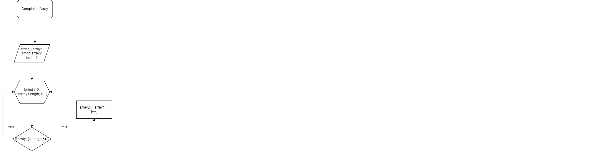

## Задача: 
Написать программу, которая из имеющегося массива строк формирует новый массив из строк, длина которых меньше, либо равна 3 символам. Первоначальный массив можно ввести с клавиатуры, либо задать на старте выполнения алгоритма. При решении не рекомендуется пользоваться коллекциями, лучше обойтись исключительно массивами.

## Решение:
1. Задаем два массива из строк.
2. Первый массивзаполняем с клавиатуры, второй оставляем пустым.
3. Задаем цикл для всех элементов  первого массива, начиная с нулевого до последнего.
4. Вводим условие проверки длинны строки. Если длинна строки <=3,  то элемент записываем во второй массив, если условие не выполняется переходим к следующему элементу.

